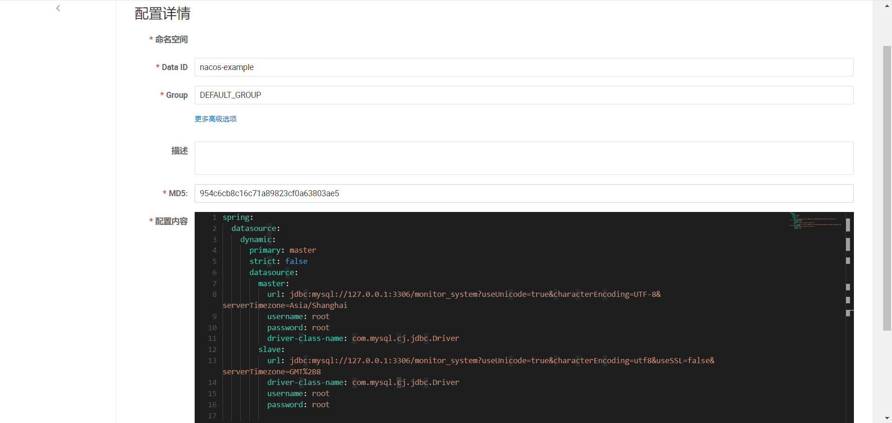
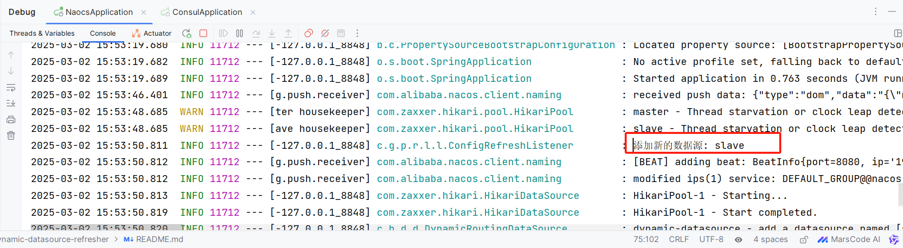

## 项目简介
本项目主要功能是为了实现在微服务架构下能够动态向配置中心添加新的数据源，并且应用程序能够感知并采用最新的数据源列表
## 项目结构
|                       模块名                        |      说明       |
|:------------------------------------------------:|:-------------:|
|         dynamic-datasource-refresher-api         | 配置中心推送数据源API  |
|      dynamic-datasource-refresher-listener       | 应用程序监听感知数据源变化 |
| dynamic-datasource-refresher-spring-boot-starter |  API和监听器自动配置  | 
|                  nacos-example                   |   Nacos使用示例   |
|                  consul-example                  |  Consul使用示例   |
## 依赖框架版本
| 框架                                     | 版本       |
|:---------------------------------------|:---------|
| Spring Cloud                           | 2020.0.3 |
| Spring Cloud Alibaba                   | 2021.1   |
| dynamic-datasource-spring-boot-starter | 3.5.1    |
## 快速开始
1.引入依赖
```xml
<dependency>
    <groupId>io.github.binarypursuer</groupId>
    <artifactId>dynamic-datasource-refresher-spring-boot-starter</artifactId>
    <version>1.0.0</version>
</dendency>
```
2.refresher相关配置，这里以nacos为例
```yaml
refresher:
  type: nacos
  nacos:
    server-addr: 127.0.0.1:8848
    username: nacos
    password: nacos
```
3.配置中心配置默认数据源，以yaml为例
```yaml
spring:
  datasource:
    dynamic:
      primary: master
      datasource:
        master:
          url: jdbc:mysql://localhost:3306/test?useUnicode=true&characterEncoding=utf-8&useSSL=false&serverTimezone=Asia/Shanghai
          username: root
          password: root
          driver-class-name: com.mysql.cj.jdbc.Driver
```
4.注入ConfigCenterApi推送数据源
```java
package io.github.binarypursuer.refresher.example.nacos.controller;

import core.io.github.binarypursuer.refresher.api.ConfigCenterApi;
import enums.io.github.binarypursuer.refresher.api.ConfigType;
import model.io.github.binarypursuer.refresher.api.DsConfig;
import org.springframework.web.bind.annotation.RequestMapping;
import org.springframework.web.bind.annotation.RestController;
import javax.annotation.Resource;
import java.util.ArrayList;
import java.util.List;

/**
 * 数据源API
 *
 * @author binarypursuer
 * @version 1.0
 * @date 2025/3/2
 */
@RestController
@RequestMapping("/datasource")
public class DatasourceController {

    @Resource
    private ConfigCenterApi configCenterApi;

    @RequestMapping("/push")
    public boolean addDatasource() {
        DsConfig dsConfig = new DsConfig();
        List<DsConfig.ServiceConfig> configs = new ArrayList<>();
        DsConfig.ServiceConfig config = new DsConfig.ServiceConfig();
        config.setDataId("nacos-example");
        config.setGroup("DEFAULT_GROUP");
        config.setType(ConfigType.YAML);
        configs.add(config);
        dsConfig.setServiceConfigs(configs);
        dsConfig.setId("slave");
        dsConfig.setUrl("jdbc:mysql://127.0.0.1:3306/monitor_system?useUnicode=true&characterEncoding=utf8&useSSL=false&serverTimezone=GMT%2B8");
        dsConfig.setUsername("root");
        dsConfig.setPassword("root");
        dsConfig.setDriverClassName("com.mysql.cj.jdbc.Driver");
        return configCenterApi.publish(dsConfig) == configs.size();
    }
}
```
5.调用接口并查看配置中心变化（可以看到配置中心已经添加了新的数据源）

6.查看应用程序日志（可以看到应用程序已经感知到新的数据源，并且已经添加到了动态数据源列表中）

# 补充说明
本项目的起源主要是在业务项目中多租户分库的场景下，每产生一个新的租户需要创建一个新的数据库，
而且需要在应用程序不停的情况下添加新的数据源并让应用程序感知到变化，所以才开始构思如何去实现这样的需求
